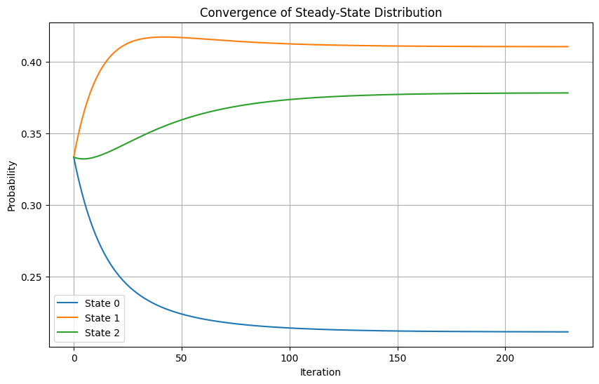
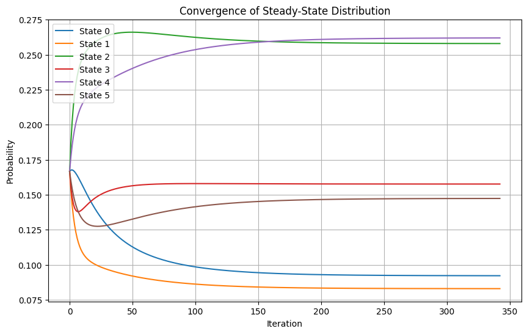
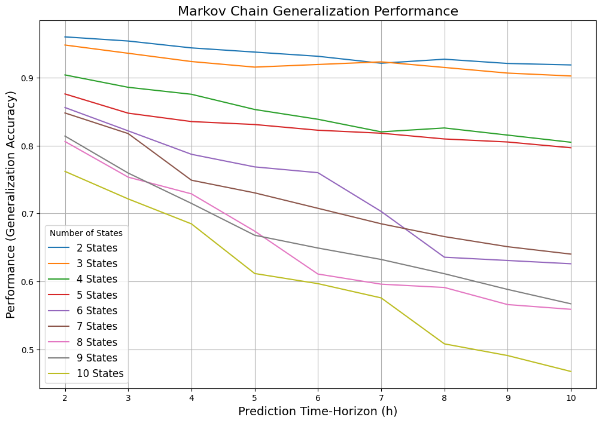
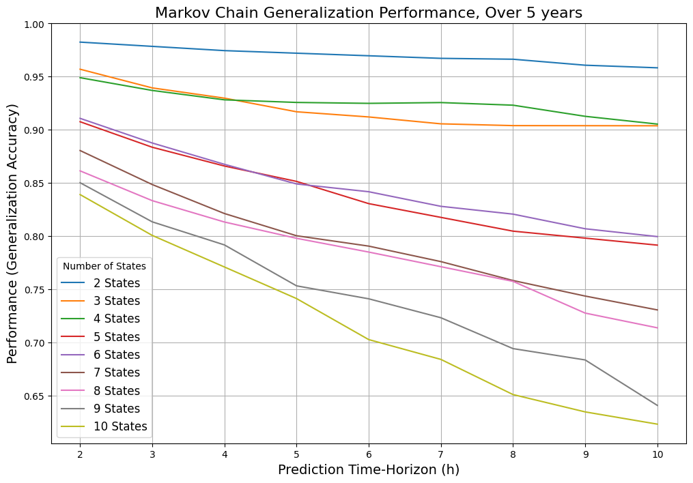

# Markov Chain Stock Prediction Using Google Stock Data

## Overview

This project implements a Markov Chain model to analyze Google stock price movements and predict stock states over various time horizons. It compares performance using historical stock data from 2019 to 2024, focusing on:

1. Stock distribution binning and state determination.
2. Building and normalizing Markov Transition Matrices.
3. Calculating steady-state distributions and predicting future states.
4. Comparing prediction performance across different time periods.

## Prerequisites

### Libraries Used

- `pandas`: For data manipulation and analysis.
- `matplotlib.pyplot`: For plotting graphs.
- `numpy`: For numerical computations.
- `yfinance`: For downloading stock data.

### Python Version

Python 3.8 or above is recommended.

### Data Source

Google stock data is fetched using the Yahoo Finance API (`yfinance`).

## Key Features

### 1. Stock Data Fetching

Stock data is downloaded using `yfinance` for the specified date ranges. The project fetches Google stock data (‘GOOG’ ticker) for two periods:

- 2022-2024
- 2019-2024

### 2. Binning Stock Prices

Stock prices are divided into discrete bins to define states:

- Histogram plots visualize stock price distributions.
- Bin edges are determined using `numpy.histogram`.

### 3. Transition Matrix

A Markov Transition Matrix is constructed:

- Tracks state transitions between consecutive closing prices.
- Normalized to ensure rows sum to 1.

### 4. Steady-State Distribution

Calculates steady-state probabilities:

- Uses matrix multiplication iteratively to find convergence.
- Plots convergence for all states.

### 5. Markov Chain Prediction

Predicts stock states over a time horizon:

- Computes `h-step` transition matrices.
- Compares predicted states against actual states.
- Calculates generalization performance.

### 6. Experimental Analysis

Performance is evaluated:

- Varies the number of bins (states) and time horizons.
- Visualizes generalization performance trends.
- Compares accuracy between 2019-2024 and 2022-2024 periods.

### 7. Performance Comparison

Differences in prediction accuracy between periods are visualized:

- Merges results from both periods.
- Highlights performance changes across states and time horizons.

## Functions and Usage

### Main Functions

#### `checkState(closingPrice, binEdges)`

Determines the state of a closing price based on bin edges.

#### `buildMarkovMatrix(trMatrix, dfData, binEdges)`

Builds the Markov Transition Matrix for given price data and bin edges.

#### `normalizeMarkovMatrix(trMatrix)`

Normalizes the transition matrix so each row sums to 1.

#### `steady_state_distribution(transition_matrix, max_steps=1000, tolerance=1e-12)`

Calculates and plots steady-state distribution convergence.

#### `markovChainPrediction(time_horizon, closingPrice, bin_edges, transition_matrix)`

Predicts stock states and calculates generalization performance.

#### `runExperiment(closing_prices, num_bins_range, time_horizon_range)`

Runs experiments for varying bin numbers and time horizons, returning a DataFrame of results.

#### `plot_results(results_df, title)`

Plots generalization performance trends.

#### `compare_performance_between_periods(preformanceDfFive, preformanceDf)`

Compares prediction performance between 2019-2024 and 2022-2024.

### How to Run

1. Install required libraries:

   ```bash
   pip install pandas matplotlib numpy yfinance
   ```

2. Run the script to:

   - Fetch stock data.
   - Build and visualize transition matrices.
   - Analyze steady-state distributions.
   - Evaluate prediction performance.

3. Observe plots for:

   - Stock distribution histograms.
   - Steady-state distribution convergence.
   - Prediction performance trends and comparisons.

## Results

### Steady-State Convergence

#### 3 States

<div>
  
</div>

#### 6 States

<div>
  
</div>

### Generalization Performance

#### Over Different Horizons (2022-2024)

<div>
  
</div>

#### Over Different Horizons (2019-2024)

<div>
  
</div>

### Performance Comparison

| Statistic | num_bins | horizon | performance_2019 | performance_2022 | performance_diff |
|-----------|----------|---------|------------------|------------------|------------------|
| Mean      | 6.0      | 6.0     | 0.837714         | 0.767444         | 0.070270         |
| Std Dev   | 2.598076 | 2.598076| 0.092894         | 0.130468         | 0.052337         |

## Insights

- **Generalization Performance**: Demonstrates the accuracy of Markov Chain predictions.
- **Steady-State Convergence**: Shows how quickly probabilities stabilize.
- **Performance Comparison**: Highlights differences in predictive accuracy between periods.

## Example Output

1. **Steady-State Distribution Convergence** Plots showing the stabilization of probabilities for each state.

2. **Prediction Accuracy** Graphs depicting accuracy trends across states and horizons.

3. **Performance Comparison** Charts illustrating differences between 2019-2024 and 2022-2024 predictions.

## Improvements

- Incorporate more sophisticated market factors (e.g., volume, news sentiment).
- Extend to multivariate Markov Chains for multi-stock analysis.
- Use reinforcement learning to improve state transitions dynamically.

## Contact

For queries, please contact Adrian Ramirez at [adramirez@lips2.clarku.edu](mailto\:adramirez@clarku.edu).

